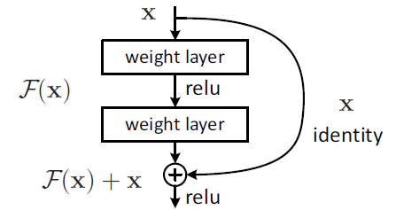

# ToyDCGAN
Toy code for CDGAN with short skip-connection

## Motivation


## Implementation ideas
Stack Res blocks to network

```
# Set forward pass.
    def call(self, x, is_training=False):
        x = tf.reshape(x, [-1, 28, 28, 1])
        # Copy tensor: expectind a 4-D dataset
        y = x
        #
        x = self.conv1(x)
        x = self.bn1(x, training=is_training)
        x = tf.nn.leaky_relu(x)
        x = self.conv2(x)
        x = self.bn2(x, training=is_training)
        # Practice skip-connection: run 1*1 conv before addition
        y = self.conv_4_skip(y)
        x = layers.Add()[x, y]
        #
        x = tf.nn.leaky_relu(x)
        x = self.flatten(x)
        x = self.fc1(x)
        x = self.bn3(x, training=is_training)
        x = tf.nn.leaky_relu(x)
        return self.fc2(x)
```
